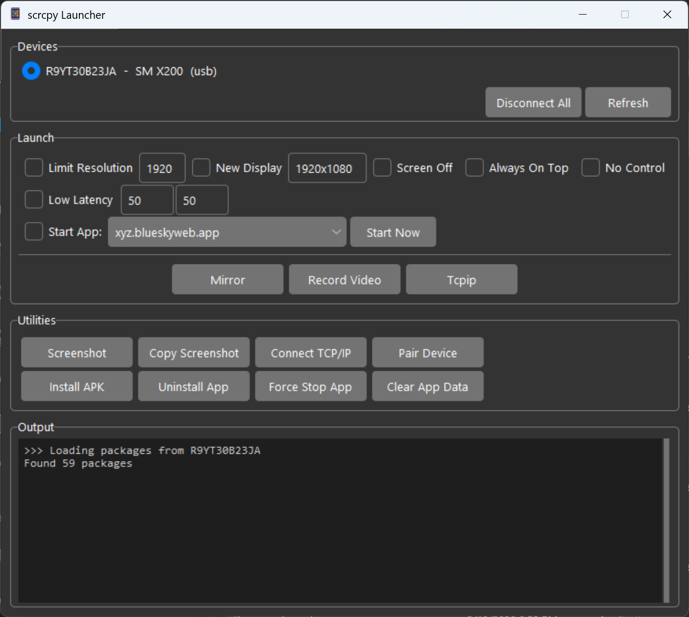

# scrcpy Launcher

A cross-platform GUI for launching [scrcpy](https://github.com/Genymobile/scrcpy) with preset configurations, managing multiple Android devices, and performing common ADB tasks — all without touching the command line.



## Features

**Device Management**
- Auto-detects connected Android devices (USB and wireless)
- Remembers your selected device across refreshes
- Connect/disconnect devices over TCP/IP
- Pair and connect new devices for wireless debugging

**Launch Scripts**
- One-click buttons for preconfigured scrcpy scripts
- Drop new `.bat` or `.sh` scripts in the folder and they appear automatically
- Built-in option checkboxes (with editable values):
  - **Limit Resolution** — caps at a configurable max resolution and 60fps
  - **New Display** — opens a virtual display at a configurable resolution
  - **Screen Off** — mirrors while keeping the phone screen off
  - **Always On Top** — keeps the scrcpy window above other windows
  - **No Control** — view-only mode, no input sent to device
  - **Start App** — launch a specific app when scrcpy connects
- [Custom options](#custom-launch-options) via `custom_args.txt` — add your own checkboxes without editing code

**Utilities**
- **Screenshot** — save to `Screenshots/` folder or copy directly to clipboard
- **Install APK** — file picker to install apps via ADB
- **Uninstall App** — browse and remove third-party packages
- **Force Stop / Clear Data** — manage apps on the device
- **Start Now** — launch any installed app from the dropdown

**Output Log**
- All operations stream their output to a built-in scrollable log
- No hidden terminal windows — runs completely windowless

## Prerequisites

- **scrcpy** and **adb** on your PATH or in the same directory as the launcher
  - Download scrcpy from [github.com/Genymobile/scrcpy](https://github.com/Genymobile/scrcpy)
- An Android device connected via USB or paired for wireless debugging

If running from source (instead of the standalone executable):
- **Python 3** with tkinter (included with most Python installations)

## Quick Start

### Option A: Download the Release

1. Download `scrcpy-launcher.zip` (Windows) or `scrcpy-launcher-mac.zip` (macOS) from [Releases](../../releases)
2. Extract into your scrcpy directory (next to `scrcpy.exe` / `scrcpy`)
3. Run **scrcpy Launcher**

### Option B: Run from Source

1. Clone this repo (or download the zip) into your scrcpy directory:
   ```
   git clone https://github.com/YOUR_USERNAME/scrcpy-launcher.git
   ```

2. Launch the GUI:
   - **Windows:** Double-click `launcher.pyw`
   - **Mac/Linux:** `python3 launcher.pyw`

3. Select a device, check any options you want, and click a launch button.

## Custom Launch Options

Add your own checkboxes by editing `custom_args.txt`. Each line defines a label and the scrcpy arguments it maps to:

```
No Audio = --no-audio
Camera Mode = --video-source=camera
```

Use `{default_value}` to add an editable text box next to the checkbox — the user can change the value before launching:

```
Max FPS = --max-fps={60}
Low Latency = --video-buffer={50} --audio-buffer={50}
Crop = --crop={1080:960:0:0}
```

Comment out lines with `.` to disable them. Blank lines are ignored.

## Building the Executable

To package the launcher as a standalone executable (no Python required to run):

1. Install build dependencies:
   ```
   pip install pyinstaller pillow
   ```

2. Run the build script:
   - **Windows:** `build.bat`
   - **Mac:** `bash build.sh`

3. Output in `dist/`:
   - Standalone executable
   - Distribution zip (includes executable, scripts, and `custom_args.txt`)

## Included Scripts

| Windows | Mac/Linux | What it does |
|---|---|---|
| `mirror.bat` | `mirror.sh` | Basic screen mirroring with touch indicators |
| `record_video.bat` | `record_video.sh` | Record screen to timestamped MP4 in `Recordings/` |
| `tcpip.bat` | `tcpip.sh` | Connect and mirror over Wi-Fi |

### Adding Your Own Scripts

Drop a `.bat` (Windows) or `.sh` (Mac/Linux) file into the directory. The launcher picks it up automatically and creates a button with a label derived from the filename.

For example, `camera_mirror.sh` becomes a button labeled **Camera Mirror**.

Scripts receive any extra arguments (like `-s SERIAL` for device selection) automatically via passthrough.

**Windows template:**
```batch
@echo off
scrcpy.exe --your-flags-here --pause-on-exit=if-error %*
```

**Mac/Linux template:**
```bash
#!/usr/bin/env bash
scrcpy --your-flags-here "$@"
```

## Project Structure

```
.
├── launcher.pyw        # GUI application (Python/tkinter)
├── custom_args.txt     # User-defined launch option checkboxes
├── build.bat           # Windows build script
├── build.sh            # macOS build script
├── build_icon.py       # Generates app icon from phone emoji
├── mirror.bat/.sh      # Basic mirroring
├── record_video.bat/.sh  # Screen recording
├── tcpip.bat/.sh       # Wireless mirroring
├── azure-theme/        # Azure ttk theme (bundled)
├── Screenshots/        # Saved screenshots (gitignored)
└── Recordings/         # Saved recordings (gitignored)
```

## Credits

- [scrcpy](https://github.com/Genymobile/scrcpy) by Genymobile
- [Azure ttk theme](https://github.com/rdbende/Azure-ttk-theme) by rdbende (MIT license)
- Mostly vibe coded with [Claude Code](https://claude.ai/code)

## License

MIT
